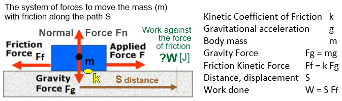
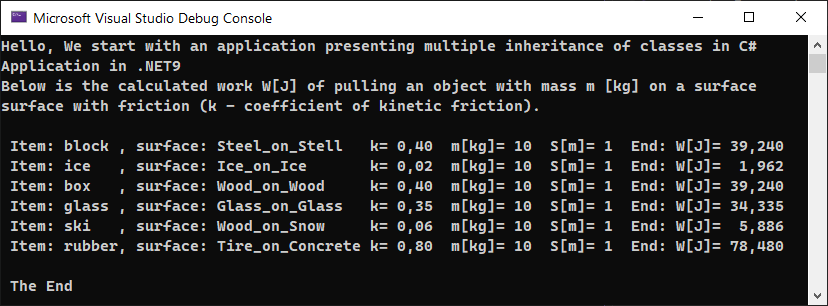

# Class inheritance in C#

## An example of an application using multiple inheritance.

Inheritance allows you to extend the capabilities of classes by 
implementing separate extension classes. The class from which other 
classes inherit is the base class, and classes that inherit from 
the base class are called derived classes. Thanks to inheritance, 
we can create new classes based on existing ones, without having 
to implement the functionalities that have already been implemented 
in the base classes.

## Calculations in accordance with DDD

Calculations in accordance with DDD, i.e. physical processes that 
the application describes and calculates. This application calculates 
the work W[J] of pulling against friction forces, an object with a mass 
of m[kg], on a surface with friction (k - coefficient of kinetic friction).

 

- The <b>CGravityForce</b> class calculates the force of gravity (weight) of an object.
- The <b>CFrictionForce</b> class inherits from CGravityForce and calculates the friction force Ff.
- The <b>CWorkDone class</b> inherits from CFrictionForce and calculates the work done.

The current parameters depend on the previous ones and reflect the actual 
physical quantities, which makes the application DDD compliant.
For many use cases, the ArrayList collection was used, which automated data entry 
and calculations. Below is the final message,

The application was made under the latest .NET9
